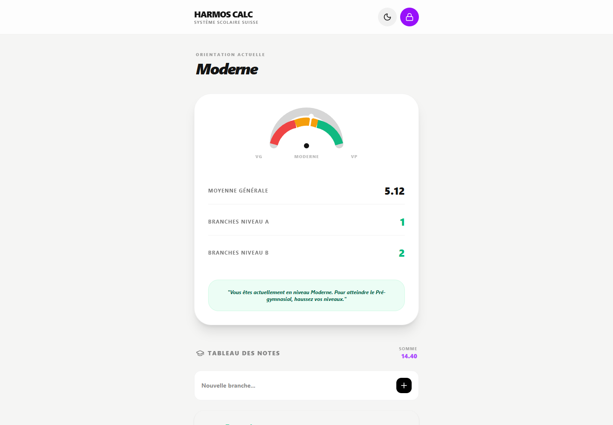
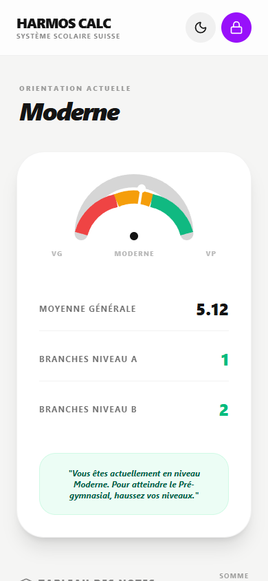

# Harmos Calc

## Rapport complet

Ce depot public presente le concept, les fonctions, les choix de conception, les outils utilises, les commandes locales et les captures d'ecran de l'application. Il est genere par l'orchestrateur uniquement apres validation de publication publique.

## Concept

Calculateur scolaire suisse. Il aide a saisir les notes, calculer les moyennes, lire l'orientation HarmoS et gerer un mode bonus lie au temps de jeu.

Rendre les resultats scolaires plus faciles a comprendre et transformer les notes en suivi concret.

Public vise: Usage familial: suivi scolaire, aide a la decision et motivation.


## Fonctionnement de l'application

L'utilisateur ajoute des notes et composants par matiere. L'application calcule les moyennes par discipline, la moyenne generale, le total des matieres principales et le nombre de niveaux A/B/C. Elle determine ensuite une orientation comme pre-gymnase, moderne ou general, affiche une progression et donne un conseil. Le mode bonus transforme les bonnes notes en temps de jeu et les mauvaises notes en retrait de temps.

## Fonctions de l'application

- Calcule les moyennes par matiere et moyenne generale.
- Evalue l'orientation scolaire selon les niveaux.
- Ajoute un mode parent et un mode bonus temps de jeu.
- Rend les resultats lisibles immediatement.
- Saisir les notes par matiere
- Calculer les moyennes
- Lire l'orientation HarmoS
- Compter les niveaux A/B/C
- Afficher progression et conseils
- Ajouter ou retirer du temps de jeu
- Proteger les reglages parent
- Reinitialiser notes, timer ou bonus

## Actualisations et evolution

- Statut courant: PUBLIC_READY.
- Securite: OK_PUBLIC.
- Fonctionnement: FONCTIONNEL.

## Options et conception

Le projet a ete concu comme un outil de decision simple pour les parents et l'eleve. Il combine calcul scolaire, visualisation immediate et mecanique de motivation, avec un espace parent protege pour gerer les regles sensibles.

### Outils, IA et moteurs utilises

- Moteur de calcul HarmoS
- Regles niveaux A/B/C
- Mode parent protege
- Timer de jeu
- Systeme bonus/malus
- Journal d'actions parent
- Stockage local
- Effets confetti et penalite
- React
- Vite
- TypeScript
- Calcul cote client
- Etat applicatif local
- Modal parent protegee par mot de passe
- Timer de temps de jeu
- Animations confetti et penalite
- Interface responsive

### Options techniques detectees

- Type de projet: node
- Gestionnaire: npm
- Nom package: react-example
- Version: 0.0.0
- Lien public: https://mamoyenne.c2rdesign.com/
- Statut securite: OK_PUBLIC

### Stack et dependances principales

- Vite/Dev server
- React
- Node.js
- Vite
- TypeScript
- Calcul cote client
- Etat applicatif local
- Modal parent protegee par mot de passe
- Timer de temps de jeu
- Animations confetti et penalite
- Interface responsive

### Scripts disponibles

- build: vite build
- clean: rm -rf dist
- dev: vite --port=3000 --host=0.0.0.0
- lint: tsc --noEmit
- preview: vite preview

### Dependances applicatives

- @google/genai ^1.29.0
- @tailwindcss/vite ^4.1.14
- @vitejs/plugin-react ^5.0.4
- better-sqlite3 ^12.4.1
- canvas-confetti ^1.9.4
- dotenv ^17.2.3
- express ^4.21.2
- lucide-react ^0.546.0
- motion ^12.23.24
- react ^19.0.0
- react-dom ^19.0.0
- vite ^6.2.0

### Dependances de developpement

- @types/express ^4.17.21
- @types/node ^22.14.0
- autoprefixer ^10.4.21
- tailwindcss ^4.1.14
- tsx ^4.21.0
- typescript ~5.8.2
- vite ^6.2.0

## Automatisations et comportements internes

- Recalcul automatique des moyennes
- Classification automatique de l'orientation
- Progression et conseils generes depuis les resultats
- Attribution automatique d'heures bonus selon les notes
- Retrait automatique si note inferieure a 4
- Timer play/pause
- Actions parent de reset et bonus/malus
- Journalisation des actions parent
- Persistance locale des parametres et resultats

## Installation locale

```powershell
npm install
```

## Lancement

```powershell
npm run dev
npm run build
```

## Captures d'ecran





## Variables d'environnement

Copier `.env.example` vers `.env` en local puis remplir les valeurs privees.

## Securite

Ne jamais publier `.env`, tokens, sessions, logs sensibles, cles privees ou donnees personnelles.
